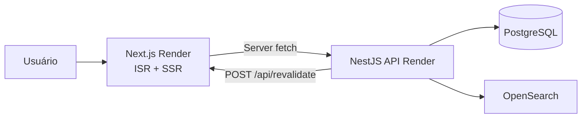

# Arquitetura de Produção — Frontend

> Deploy operacional no **Render**, integração com a API do backend e estratégia de cache ISR.
>
> Complementa o [SDD](./SDD.md), a [arquitetura](./arquitetura.md) e o [README](../README.md).

| | |
|---|---|
| **Repositório** | [github.com/Lucas-Braz7x/portal-noticias-frontend](https://github.com/Lucas-Braz7x/portal-noticias-frontend) |
| **Produção** | [portal-noticias-frontend.onrender.com](https://portal-noticias-frontend.onrender.com) |
| **API consumida** | [portal-noticias-backend.onrender.com/api/v1](https://portal-noticias-backend.onrender.com/api/v1) |

---

## 1. Arquitetura atual (Render)

Deploy simplificado: **um Web Service** Next.js no Render, consumindo a API NestJS em repositório separado.



| Componente | Onde roda | Papel |
|------------|-----------|-------|
| Frontend (este repo) | Render Web Service | UI RF01–RF06/RF11; ISR; webhook de revalidação |
| API | [portal-noticias-backend](https://github.com/Lucas-Braz7x/portal-noticias-backend) | REST `/api/v1`; cache HTTP; dispara webhook |
| PostgreSQL | Render Postgres | Persistência (backend) |
| OpenSearch | Externo ou desabilitado | Busca `q` (backend) |

Detalhes da API, worker e indexação: [arquitetura-producao.md do backend](https://github.com/Lucas-Braz7x/portal-noticias-backend/blob/main/docs/arquitetura-producao.md).

---

## 2. Fetch e CORS

| Decisão | Motivo |
|---------|--------|
| **Server Components** por padrão | Backend **não** habilita CORS |
| `fetch` via `lib/api` com `API_URL` | Chamadas só no servidor Node do Next.js |
| Sem BFF genérico | Escopo mínimo; contratos REST diretos |

Em produção, `API_URL=https://portal-noticias-backend.onrender.com/api/v1` — nunca exposta ao browser como endpoint direto de dados.

---

## 3. Cache ISR (sem Redis)

Estratégia em duas camadas, alinhada ao backend:

| Camada | Mecanismo | Onde |
|--------|-----------|------|
| API (leitura) | `Cache-Control: public, max-age=N` | Backend — ver `CACHE_*_MAX_AGE` |
| Frontend | ISR `revalidate` + `tags` | `lib/api/cache.ts` |
| Invalidação | Webhook server-to-server | `POST /api/revalidate` |

### Tags e TTLs

| Tag | Endpoints consumidos | Revalidate | Justificativa |
|-----|---------------------|------------|---------------|
| `articles` | `GET /articles`, `GET /articles/:slug` | 60s | Conteúdo muda com ingestão |
| `categories` | `GET /categories` | 300s | Catálogo estável |
| `tags` | `GET /tags` | 300s | Catálogo estável |

### Webhook

Após ingestão, o backend chama:

```http
POST https://portal-noticias-frontend.onrender.com/api/revalidate
X-Revalidate-Secret: <REVALIDATE_SECRET>
Content-Type: application/json

{ "tags": ["articles", "categories", "tags"] }
```

Falha no webhook **não** bloqueia a API — o TTL ISR cobre até a próxima revalidação periódica.

---

## 4. CI/CD e deploy

| Evento | GitHub Actions | Render |
|--------|----------------|--------|
| PR | lint, format, test:cov, build | Preview automático |
| Push `main` + CI verde | deploy hook | Produção |

Guia passo a passo: [deploy-render.md](./deploy-render.md).

**Limitação cross-repo:** previews do frontend não herdam API do PR do backend — configurar `API_URL` de preview para staging/produção fixa.

---

## 5. Testes em produção vs local

| Suite | Onde roda | Escopo |
|-------|-----------|--------|
| Vitest | CI + pre-commit | API client, utils, componentes |
| Playwright E2E | **Apenas local** | Páginas RF01–RF06, RF11 |

Motivo: E2E exige backend real com seed — ver [proximos-passos.md §1](./proximos-passos.md#1-e2e-no-ci).

---

## 6. Evolução futura (fora do escopo atual)

| Direção | Quando considerar |
|---------|-------------------|
| CDN (CloudFront) na frente do Render | Tráfego alto; cache estático global |
| Edge middleware | Geo, A/B, redirects |
| Redis + ISR | Backend com ElastiCache — webhook permanece |
| Auth + rotas admin | Backend com JWT/Cognito |
| i18n | Produto multi-idioma |

---

*Versão: 1.0 — Agosto/2026*
