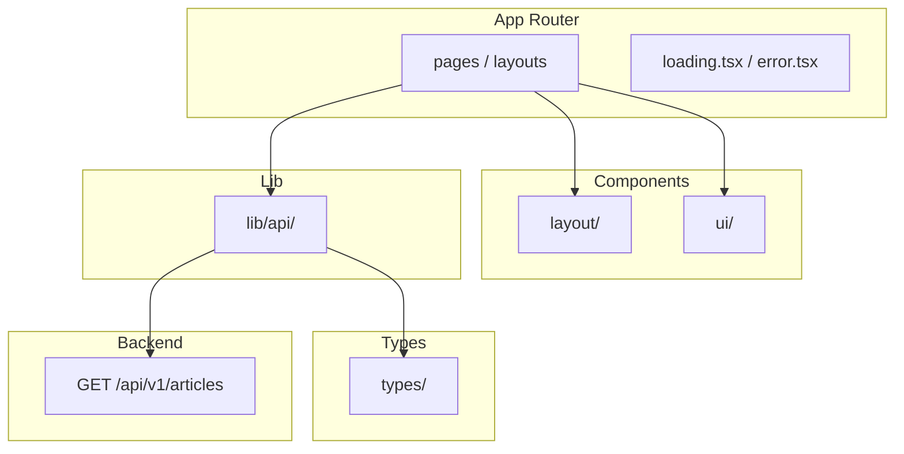

# Arquitetura — Portal de Notícias Frontend

> Guia de decisões arquiteturais, padrões e convenções do projeto.  
> Complementa o [SDD](./SDD.md), a [baseline de requisitos](./requisitos-funcionais-nao-funcionais.md) e a [arquitetura de produção](./arquitetura-producao.md).

---

## 1. Visão geral

O frontend segue uma arquitetura em camadas simples, priorizando **Server Components** do Next.js App Router e fetch server-side para a API do backend.



### Princípios adotados

| Princípio | Aplicação |
|-----------|-----------|
| **Server Components por padrão** | Fetch na camada de página; sem `'use client'` desnecessário |
| **Clean Code** | Funções pequenas, nomes expressivos, SRP |
| **TDD** | Red → Green → Refactor no API client e componentes críticos |
| **Tipagem forte** | Tipos espelham contratos do backend; validação runtime com Zod na fronteira da API |
| **SASS Modules** | Estilos escopados por componente; tokens em `styles/` |
| **Mobile-first** | Layout base para telas pequenas; breakpoints com `min-width` — ver [mobile-first.md](./mobile-first.md) |

---

## 2. Camadas e responsabilidades

### 2.1 App Router (`src/app/`)

- **Pages** — Server Components que buscam dados e compõem a UI.
- **`_components/`** — seções async da home (`HomeHero`, `ArticleFiltersSection`, `ArticleListSection`) e wrapper client `ArticleListRegion`.
- **Layouts** — shell global (header, footer, metadata).
- **loading.tsx / error.tsx / not-found.tsx** — estados da interface (RF11).

**Regra:** páginas não chamam `fetch` diretamente — usam `lib/api/`.

### 2.2 Components (`src/components/`)

| Pasta | Responsabilidade |
|-------|------------------|
| `layout/` | Header, Footer, Container — estrutura da página |
| `articles/` | ArticleList, ArticleCard, ArticleFilters, Pagination, ArticleDetailView |
| `ui/` | EmptyState, ErrorMessage, Spinner, skeletons — estados reutilizáveis |

**Regra:** componentes de UI são apresentacionais; sem lógica de API.

### 2.3 Lib (`src/lib/`)

| Pasta / arquivo | Responsabilidade |
|-----------------|------------------|
| `api/client.ts` | `fetch` wrapper, parse de erros, base URL |
| `api/parse.ts` | `parseApiResponse` + `ApiValidationError` |
| `api/schemas/` | Schemas Zod dos contratos da API |
| `api/cache.ts` | Tags e `revalidate` por recurso |
| `api/articles.ts` | `listArticles`, `getArticleBySlug` |
| `api/categories.ts` | `listCategories` |
| `api/tags.ts` | `listTags` |
| `constants/pagination.ts` | `DEFAULT_PAGE_LIMIT`, `PAGE_SIZE_OPTIONS` |
| `utils/` | `list-params`, `pagination`, `article-list-region`, `format-date`, `truncate-text` |

### 2.4 Types (`src/types/`)

Tipos TypeScript inferidos dos schemas Zod em `lib/api/schemas/`. Reexportados em `types/article.ts` para uso em componentes.

---

## 3. Boundary de dados (Zod)

Toda resposta da API passa por validação runtime antes de chegar aos componentes:

```
fetch → response.json() → parseApiResponse(schema) → componente
```

| Erro | Classe | Quando |
|------|--------|--------|
| HTTP 4xx/5xx | `ApiClientError` | Resposta de erro da API |
| Payload inválido | `ApiValidationError` | JSON não bate com o schema Zod |

Schemas em `src/lib/api/schemas/article.ts` espelham o [SDD do backend](https://github.com/Lucas-Braz7x/portal-noticias-backend/blob/main/docs/SDD.md#4-contratos-da-api).

---

## 4. Estratégia de fetch e cache

| Cenário | Abordagem |
|---------|-----------|
| Listagem / detalhe / filtros | Server Component → `lib/api` → `fetch` com `API_URL` |
| Troca de página na home | `Pagination` (client) navega via `router.push` sem scroll; `ArticleListRegion` rola até a listagem |
| Busca com debounce (futuro) | CORS no backend ou debounce client-side no formulário |
| Cache ISR | `next.revalidate` + `tags` via helpers em `lib/api/cache.ts` |

### Cache por recurso

| Tag | Endpoints | Revalidate | Justificativa |
|-----|-----------|------------|---------------|
| `articles` | `GET /articles`, `GET /articles/:slug` | 60s | Conteúdo muda com ingestão/publicação |
| `categories` | `GET /categories` | 300s | Catálogo estável; muda raramente |
| `tags` | `GET /tags` | 300s | Catálogo estável; muda raramente |

Helpers: `articlesCacheOptions()`, `categoriesCacheOptions()`, `tagsCacheOptions()`.

### Invalidação on-demand

Rota `POST /api/revalidate` (`src/app/api/revalidate/route.ts`):

- Header `X-Revalidate-Secret` deve corresponder a `REVALIDATE_SECRET`
- Body opcional: `{ "tags": ["articles", "categories", "tags"] }` (tags desconhecidas são ignoradas; default `articles`)
- Após ingestão, o backend chama este endpoint (fire-and-forget) quando `FRONTEND_REVALIDATE_URL` e `REVALIDATE_SECRET` estão configurados

> O backend não habilita CORS. Toda chamada à API é **server-side**; o webhook de revalidação é server-to-server.

### Suspense granular (home)

A home usa `<Suspense>` por seção para streaming independente:

| Seção | Componente async | Fallback |
|-------|------------------|----------|
| Filtros | `ArticleFiltersSection` (em `page.tsx`) | `ArticleFiltersSkeleton` |
| Listagem | `ArticleListSection` (em `page.tsx`) | `ArticleListSkeleton` |

`loading.tsx` na raiz permanece como fallback de navegação entre rotas.

### Paginação numerada (RF02)

- `ArticleListSection` busca a página indicada por `?page=` (default `1`) e `?limit=` via `listArticles()`.
- `Pagination` renderiza controles Anterior/Próxima, números de página e seletor de itens por página.
- `ArticleListRegion` envolve a listagem e faz scroll suave até o topo dos cards ao trocar de página.
- Filtros (`q`, `category`, `tag`) são preservados na URL ao trocar de página; submit do formulário reseta para página 1.
- Página fora do intervalo (`?page=99`) redireciona para a última página válida.

---

## 5. Estrutura de pastas

```
src/
├── app/
│   ├── _components/      # Seções da home (Server + ArticleListRegion client)
│   ├── layout.tsx
│   ├── page.tsx
│   ├── page.module.scss  # estilos do HomeHero
│   ├── loading.tsx
│   ├── error.tsx
│   ├── error.module.scss
│   ├── not-found.tsx
│   ├── globals.scss
│   ├── articles/[slug]/
│   │   ├── page.tsx
│   │   └── loading.tsx
│   └── api/revalidate/
│       └── route.ts      # webhook ISR (backend → frontend)
├── components/
│   ├── articles/
│   ├── layout/
│   └── ui/
├── lib/
│   ├── api/
│   │   ├── schemas/
│   │   ├── cache.ts
│   │   ├── parse.ts
│   │   ├── client.ts
│   │   ├── articles.ts
│   │   ├── categories.ts
│   │   └── tags.ts
│   ├── revalidate/
│   │   └── handle-revalidate-request.ts
│   ├── constants/
│   │   └── pagination.ts
│   └── utils/
├── types/
└── styles/
    ├── _variables.scss
    └── _mixins.scss

test/
├── setup.ts
├── app/
│   └── _components/
│       └── ArticleListRegion.spec.tsx
├── lib/
│   ├── api/
│   │   ├── parse.spec.ts
│   │   ├── articles.spec.ts
│   │   ├── categories.spec.ts
│   │   └── tags.spec.ts
│   ├── revalidate/
│   │   └── handle-revalidate-request.spec.ts
│   └── utils/
│       ├── list-params.spec.ts
│       ├── pagination.spec.ts
│       ├── format-date.spec.ts
│       └── truncate-text.spec.ts
└── components/
    ├── articles/
    │   ├── ArticleList.spec.tsx
    │   ├── ArticleCard.spec.tsx
    │   ├── ArticleFilters.spec.tsx
    │   ├── Pagination.spec.tsx
    │   └── ArticleDetailView.spec.tsx
    └── layout/
        └── ThemeToggle.spec.tsx

e2e/                      # Playwright E2E (backend real + seed)
├── home.spec.ts
├── article-detail.spec.ts
└── not-found.spec.ts
```

---

## 6. TDD e testes

| Camada | Onde testar | Ferramenta |
|--------|-------------|------------|
| API client + Zod | `test/lib/api/` | Vitest + mock de `fetch` |
| Utils | `test/lib/utils/` | Vitest |
| Componentes | `test/components/` | Vitest + Testing Library |
| E2E (RF01–RF06, RF11) | `e2e/` | Playwright + backend real (local) |

**Comandos:**

```bash
yarn test              # unitários (pre-commit)
yarn test:cov          # unitários + cobertura (mínimo global 75%)
yarn test:watch        # unitários em modo interativo
yarn test:e2e          # E2E — apenas local
```

**Cobertura unitária:** threshold global de **75%** (branches, functions, lines, statements) configurado em `vitest.config.ts`. Exclusões: `src/app/**` (páginas/layouts — E2E local) e `src/types/**` (tipos).

**Pre-commit (Husky):** `yarn lint`, `yarn format:check` e `yarn test:cov`.

**CI (GitHub Actions):** jobs `quality`, `unit` e `build` em [`.github/workflows/ci.yml`](../.github/workflows/ci.yml). E2E **não** roda no CI.

**Pré-requisito E2E:** [backend](https://github.com/Lucas-Braz7x/portal-noticias-backend) com docker-compose, migrations e seed rodando em `localhost:3000`.

---

## 7. Responsividade

Padrão **mobile-first** com SASS Modules. Breakpoints, mixin `respond-from` e convenções de grid/tipografia estão em [mobile-first.md](./mobile-first.md).

---

## 8. O que evitar

- Chamar a API diretamente em componentes de UI
- `'use client'` sem necessidade de interatividade
- Fetch client-side para a API backend (sem CORS)
- Misturar Tailwind com SASS Modules
- Media queries `max-width` ou breakpoints fora dos tokens do projeto

---

*Versão: 1.2 — Agosto/2026*
