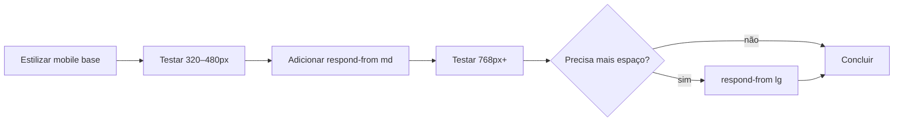

# Mobile-first — Portal de Notícias Frontend

> Padrão de responsividade adotado no projeto.  
> Complementa a [arquitetura](./arquitetura.md) e o [SDD](./SDD.md).

---

## 1. Princípio

O layout é projetado **primeiro para telas pequenas** (mobile) e evolui progressivamente para telas maiores com `@media (min-width: …)`.

| Abordagem | Status |
|-----------|--------|
| **Mobile-first** (`min-width`) | ✅ adotado |
| Desktop-first (`max-width`) | ❌ evitar |
| Frameworks utilitários (Tailwind) | ❌ fora do escopo — SASS Modules |

**Por quê:** menor superfície de CSS base, melhor performance em dispositivos móveis e alinhamento com o tráfego predominante de leitura de notícias.

---

## 2. Breakpoints

Valores em `rem` (base 16px) para respeitar preferências de zoom do usuário.

| Token | Valor | Uso típico |
|-------|-------|------------|
| — (base) | `< 48rem` | Layout em coluna única, navegação compacta, filtros empilhados |
| `$breakpoint-md` | `48rem` (768px) | Grid de 2 colunas, filtros em linha |
| `$breakpoint-lg` | `64rem` (1024px) | Layouts mais amplos, sidebars (futuro) |
| `$breakpoint-xl` | `80rem` (1280px) | Ajustes finos em telas largas (uso raro) |

> O container global (`$container-max-width: 72rem`) já limita a largura útil em desktops — breakpoints acima de `lg` são exceção.

### Regras dos breakpoints

1. **Só `min-width`** — nunca `@media (max-width: …)` para layout estrutural.
2. **Tokens centralizados** — valores definidos em `src/styles/_variables.scss`; não repetir números mágicos nos módulos.
3. **Mixin obrigatório** — media queries via `@include respond-from(md)` em `src/styles/_mixins.scss`.
4. **Mobile é o default** — estilos fora de media query aplicam-se a todas as telas; breakpoints apenas **adicionam** ou **sobrescreem**.

---

## 3. Tokens e mixin (SCSS)

### Variáveis (`src/styles/_variables.scss`)

```scss
$breakpoint-md: 48rem;
$breakpoint-lg: 64rem;
$breakpoint-xl: 80rem;
```

### Mixin (`src/styles/_mixins.scss`)

```scss
@mixin respond-from($breakpoint) {
  @if $breakpoint == md {
    @media (min-width: $breakpoint-md) { @content; }
  } @else if $breakpoint == lg {
    @media (min-width: $breakpoint-lg) { @content; }
  } @else if $breakpoint == xl {
    @media (min-width: $breakpoint-xl) { @content; }
  } @else {
    @error "Breakpoint desconhecido: #{$breakpoint}. Use md, lg ou xl.";
  }
}
```

### Uso em módulos

```scss
@use '../../styles/variables' as *;
@use '../../styles/mixins' as *;

.list {
  display: grid;
  gap: $spacing-lg;

  @include respond-from(md) {
    grid-template-columns: repeat(2, 1fr);
  }
}
```

---

## 4. Padrões por camada

### 4.1 Layout global

| Elemento | Mobile (base) | `md+` |
|----------|---------------|-------|
| `Container` | `padding-inline: $spacing-md` | igual — max-width centraliza |
| `Header` | flex, altura mínima confortável para toque | sem mudança estrutural obrigatória |
| `main` | coluna única | coluna única (conteúdo editorial) |

### 4.2 Tipografia fluida

Preferir `clamp()` para títulos hero em vez de múltiplos breakpoints de `font-size`:

```scss
.title {
  font-size: clamp(1.75rem, 4vw, 2.5rem);
}
```

Para corpo e metadados, tamanhos fixos em `rem` são suficientes.

### 4.3 Grids e listas

| Componente | Mobile | `md+` |
|------------|--------|-------|
| `ArticleList` | 1 coluna | 2 colunas |
| `ArticleFilters` | campos empilhados | 4 colunas (busca, categoria, tag, ações) |
| `ArticleCard` | coluna flex | sem alteração — card já é fluido |

Novos grids devem começar em **1 coluna** e só expandir em `md` ou `lg` quando houver ganho claro de leitura.

### 4.4 Espaçamento

Usar tokens `$spacing-*` — não valores ad hoc. Em mobile, preferir `$spacing-md` e `$spacing-lg`; em telas maiores, aumentar `padding-block` de seções hero se necessário.

### 4.5 Toque e acessibilidade

- Área clicável mínima: **44×44px** em links e botões primários.
- Inputs e selects: `padding` vertical confortável (`$spacing-sm` ou mais).
- Não depender de `:hover` como único affordance — estados de foco via `@include focus-ring`.

---

## 5. O que evitar

| Anti-padrão | Motivo |
|-------------|--------|
| `@media (max-width: …)` para grid/flex | inverte a cascata; dificulta manutenção |
| Breakpoints arbitrários (`37.5rem`, `900px`) | fragmenta o design system |
| `display: none` para esconder conteúdo essencial no mobile | prejudica acesso e SEO |
| Unidades `px` em media queries | ignora zoom do usuário |
| Estilos responsivos inline ou em `globals.scss` | quebra escopo dos SASS Modules |
| Imagens sem `max-width: 100%` | overflow horizontal |

---

## 6. Fluxo de trabalho



1. Escrever CSS **sem** media query (estado mobile).
2. Validar em viewport estreita (DevTools: iPhone SE / 375px).
3. Adicionar `@include respond-from(md)` apenas quando o layout pedir mais colunas ou alinhamento horizontal.
4. Repetir para `lg`/`xl` somente se necessário.

---

## 7. Referências no código atual

| Arquivo | Padrão aplicado |
|---------|-----------------|
| `ArticleList.module.scss` | grid 1 col → 2 colunas via `@include respond-from(md)` |
| `ArticleFilters.module.scss` | grid empilhado → linha via `@include respond-from(md)` |
| `page.module.scss` | `clamp()` no título hero |
| `Container` / mixin `container` | largura fluida com max-width |
| `_mixins.scss` | `respond-from`, `interactive-focus`, `focus-ring` |

---

## 8. Checklist de revisão

Antes de abrir PR com mudanças de layout:

- [ ] Estilos base funcionam sem media query (mobile)?
- [ ] Breakpoint usa token + mixin, não valor solto?
- [ ] Sem scroll horizontal em 320px e 375px?
- [ ] Texto legível sem zoom (mín. ~16px em inputs)?
- [ ] Alvos de toque adequados em botões e links?
- [ ] Conteúdo essencial visível em todas as larguras?

---

*Versão: 1.0 — Agosto/2026*
